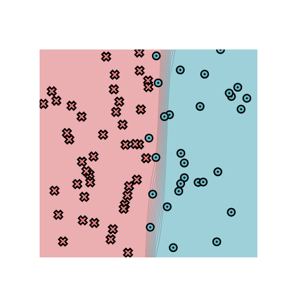
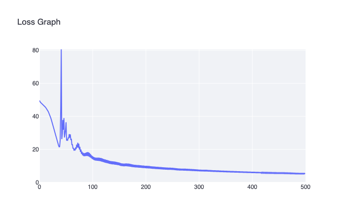
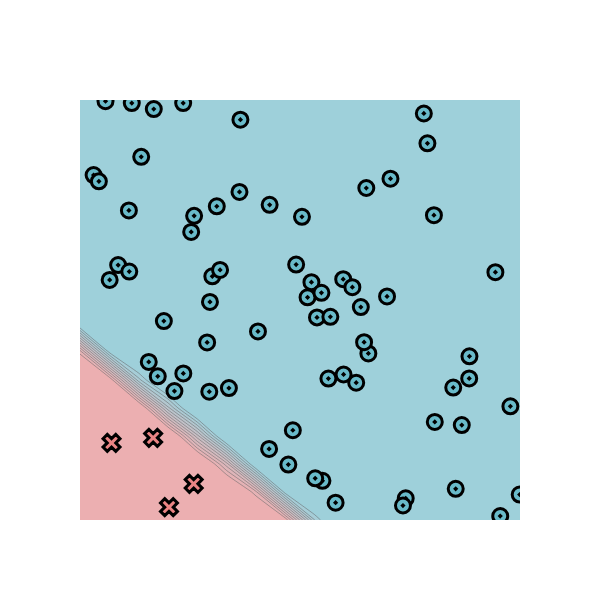
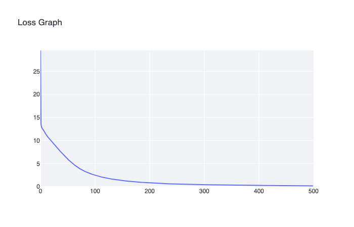
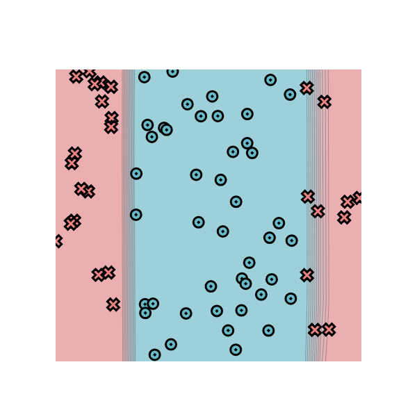
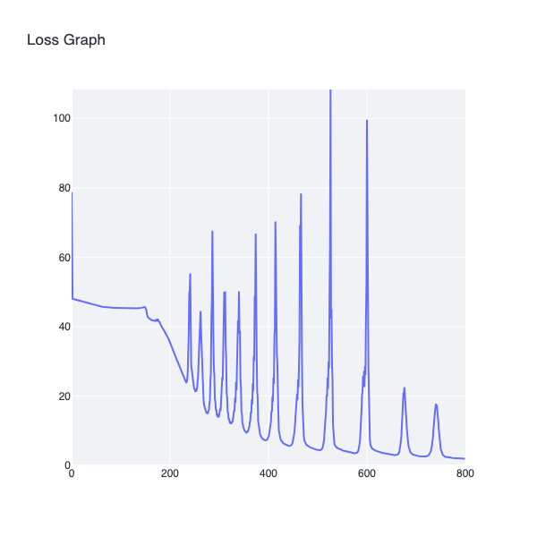
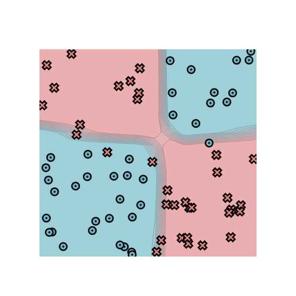
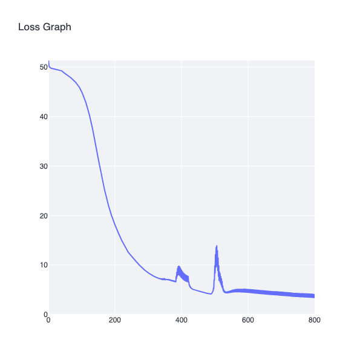

# minitorch
The full minitorch student suite. 


To access the autograder: 

* Module 0: https://classroom.github.com/a/qDYKZff9
* Module 1: https://classroom.github.com/a/6TiImUiy
* Module 2: https://classroom.github.com/a/0ZHJeTA0
* Module 3: https://classroom.github.com/a/U5CMJec1
* Module 4: https://classroom.github.com/a/04QA6HZK
* Quizzes: https://classroom.github.com/a/bGcGc12k

---

## Task 1.5: Scalar Training Results

Training a 3-layer scalar neural network on 4 datasets using SGD.

### Simple Dataset
**Config:** PTS=50, HIDDEN=6, LR=0.5, Epochs=500

```
Epoch 10 loss 25.7662 correct 41
Epoch 20 loss 14.9354 correct 50
Epoch 30 loss 8.5790 correct 50
Epoch 40 loss 5.5619 correct 50
Epoch 50 loss 3.8619 correct 50
Epoch 60 loss 2.8289 correct 50
Epoch 70 loss 2.1702 correct 50
Epoch 80 loss 1.7250 correct 50
Epoch 90 loss 1.4103 correct 50
Epoch 100 loss 1.1783 correct 50
Epoch 110 loss 1.0024 correct 50
Epoch 120 loss 0.8659 correct 50
Epoch 130 loss 0.7578 correct 50
Epoch 140 loss 0.6704 correct 50
Epoch 150 loss 0.5986 correct 50
Epoch 160 loss 0.5390 correct 50
Epoch 170 loss 0.4893 correct 50
Epoch 180 loss 0.4472 correct 50
Epoch 190 loss 0.4110 correct 50
Epoch 200 loss 0.3795 correct 50
Epoch 210 loss 0.3520 correct 50
Epoch 220 loss 0.3277 correct 50
Epoch 230 loss 0.3062 correct 50
Epoch 240 loss 0.2870 correct 50
Epoch 250 loss 0.2697 correct 50
Epoch 260 loss 0.2542 correct 50
Epoch 270 loss 0.2402 correct 50
Epoch 280 loss 0.2274 correct 50
Epoch 290 loss 0.2157 correct 50
Epoch 300 loss 0.2051 correct 50
Epoch 310 loss 0.1953 correct 50
Epoch 320 loss 0.1863 correct 50
Epoch 330 loss 0.1780 correct 50
Epoch 340 loss 0.1704 correct 50
Epoch 350 loss 0.1632 correct 50
Epoch 360 loss 0.1566 correct 50
Epoch 370 loss 0.1504 correct 50
Epoch 380 loss 0.1447 correct 50
Epoch 390 loss 0.1393 correct 50
Epoch 400 loss 0.1342 correct 50
Epoch 410 loss 0.1295 correct 50
Epoch 420 loss 0.1250 correct 50
Epoch 430 loss 0.1208 correct 50
Epoch 440 loss 0.1169 correct 50
Epoch 450 loss 0.1131 correct 50
Epoch 460 loss 0.1096 correct 50
Epoch 470 loss 0.1063 correct 50
Epoch 480 loss 0.1032 correct 50
Epoch 490 loss 0.1002 correct 50
Epoch 500 loss 0.0974 correct 50
```

**Final accuracy: 50/50**




---

### Diag Dataset
**Config:** PTS=50, HIDDEN=6, LR=0.5, Epochs=500

```
Epoch 10 loss 19.9002 correct 40
Epoch 20 loss 16.4038 correct 40
Epoch 30 loss 12.5774 correct 45
Epoch 40 loss 10.5030 correct 46
Epoch 50 loss 9.1571 correct 47
Epoch 60 loss 8.2309 correct 47
Epoch 70 loss 7.5035 correct 47
Epoch 80 loss 6.8992 correct 48
Epoch 90 loss 6.3859 correct 48
Epoch 100 loss 5.9417 correct 48
Epoch 110 loss 5.5521 correct 48
Epoch 120 loss 5.2063 correct 49
Epoch 130 loss 4.8966 correct 49
Epoch 140 loss 4.6177 correct 49
Epoch 150 loss 4.4638 correct 48
Epoch 160 loss 13.3988 correct 45
Epoch 170 loss 6.7188 correct 46
Epoch 180 loss 5.8586 correct 46
Epoch 190 loss 5.7819 correct 47
Epoch 200 loss 5.7509 correct 47
Epoch 210 loss 5.6567 correct 47
Epoch 220 loss 5.5448 correct 47
Epoch 230 loss 5.2173 correct 47
Epoch 240 loss 5.2810 correct 47
Epoch 250 loss 5.2840 correct 47
Epoch 260 loss 5.2052 correct 47
Epoch 270 loss 5.2043 correct 47
Epoch 280 loss 5.1610 correct 47
Epoch 290 loss 4.9795 correct 47
Epoch 300 loss 4.8613 correct 47
Epoch 310 loss 4.7841 correct 47
Epoch 320 loss 4.7199 correct 47
Epoch 330 loss 4.6578 correct 47
Epoch 340 loss 4.5962 correct 47
Epoch 350 loss 4.5357 correct 47
Epoch 360 loss 4.4766 correct 47
Epoch 370 loss 4.4191 correct 47
Epoch 380 loss 4.3632 correct 47
Epoch 390 loss 4.3087 correct 47
Epoch 400 loss 4.2557 correct 47
Epoch 410 loss 4.2040 correct 47
Epoch 420 loss 4.1536 correct 47
Epoch 430 loss 4.1045 correct 47
Epoch 440 loss 4.0566 correct 47
Epoch 450 loss 4.0100 correct 47
Epoch 460 loss 3.9645 correct 47
Epoch 470 loss 3.9201 correct 47
Epoch 480 loss 3.8767 correct 47
Epoch 490 loss 3.8345 correct 47
Epoch 500 loss 3.7932 correct 47
```

**Final accuracy: 47/50**




---

### Split Dataset
**Config:** PTS=50, HIDDEN=6, LR=0.5, Epochs=800

```
Epoch 10 loss 34.1669 correct 28
Epoch 20 loss 33.8968 correct 36
Epoch 30 loss 33.6208 correct 33
Epoch 40 loss 33.0265 correct 33
Epoch 50 loss 32.1636 correct 33
Epoch 60 loss 31.1022 correct 33
Epoch 70 loss 29.9173 correct 36
Epoch 80 loss 28.5113 correct 38
Epoch 90 loss 27.1073 correct 38
Epoch 100 loss 25.8428 correct 39
Epoch 110 loss 28.5744 correct 32
Epoch 120 loss 30.2543 correct 32
Epoch 130 loss 25.4007 correct 38
Epoch 140 loss 25.0532 correct 38
Epoch 150 loss 26.6374 correct 35
Epoch 160 loss 25.5643 correct 37
Epoch 170 loss 23.3789 correct 39
Epoch 180 loss 22.9471 correct 39
Epoch 190 loss 22.8437 correct 40
Epoch 200 loss 22.7581 correct 40
Epoch 210 loss 22.7000 correct 40
Epoch 220 loss 22.6963 correct 40
Epoch 230 loss 22.7781 correct 40
Epoch 240 loss 22.9420 correct 40
Epoch 250 loss 22.9202 correct 40
Epoch 260 loss 22.8950 correct 40
Epoch 270 loss 22.8782 correct 40
Epoch 280 loss 22.8645 correct 40
Epoch 290 loss 22.8516 correct 41
Epoch 300 loss 22.4017 correct 40
Epoch 310 loss 22.3656 correct 40
Epoch 320 loss 23.0327 correct 41
Epoch 330 loss 22.9217 correct 41
Epoch 340 loss 22.8610 correct 41
Epoch 350 loss 22.3610 correct 40
Epoch 360 loss 22.3708 correct 40
Epoch 370 loss 22.3820 correct 40
Epoch 380 loss 22.3919 correct 40
Epoch 390 loss 22.3997 correct 40
Epoch 400 loss 22.4051 correct 40
Epoch 410 loss 22.4082 correct 40
Epoch 420 loss 22.4093 correct 40
Epoch 430 loss 22.4086 correct 40
Epoch 440 loss 22.4065 correct 40
Epoch 450 loss 22.4031 correct 41
Epoch 460 loss 22.3987 correct 41
Epoch 470 loss 22.3935 correct 41
Epoch 480 loss 22.3876 correct 41
Epoch 490 loss 22.3811 correct 41
Epoch 500 loss 22.3742 correct 41
```

**Final accuracy: 41/50**




---

### Xor Dataset
**Config:** PTS=50, HIDDEN=6, LR=0.5, Epochs=800

```
Epoch 10 loss 32.4694 correct 32
Epoch 20 loss 32.3526 correct 32
Epoch 30 loss 32.2370 correct 32
Epoch 40 loss 32.0804 correct 32
Epoch 50 loss 31.8673 correct 32
Epoch 60 loss 31.5692 correct 32
Epoch 70 loss 31.1488 correct 32
Epoch 80 loss 30.5687 correct 34
Epoch 90 loss 29.8324 correct 38
Epoch 100 loss 28.9960 correct 36
Epoch 110 loss 28.2232 correct 37
Epoch 120 loss 27.6406 correct 36
Epoch 130 loss 27.1974 correct 36
Epoch 140 loss 26.8610 correct 36
Epoch 150 loss 26.6350 correct 36
Epoch 160 loss 26.4636 correct 36
Epoch 170 loss 26.4036 correct 37
Epoch 180 loss 26.3192 correct 37
Epoch 190 loss 26.1159 correct 37
Epoch 200 loss 26.0762 correct 37
Epoch 210 loss 25.3081 correct 37
Epoch 220 loss 23.7367 correct 36
Epoch 230 loss 23.0167 correct 41
Epoch 240 loss 22.0061 correct 41
Epoch 250 loss 21.0539 correct 42
Epoch 260 loss 20.7368 correct 41
Epoch 270 loss 19.8400 correct 41
Epoch 280 loss 19.3023 correct 41
Epoch 290 loss 19.3987 correct 41
Epoch 300 loss 18.8372 correct 41
Epoch 310 loss 18.6842 correct 41
Epoch 320 loss 18.9400 correct 41
Epoch 330 loss 19.7327 correct 40
Epoch 340 loss 19.9819 correct 40
Epoch 350 loss 18.5638 correct 40
Epoch 360 loss 18.2986 correct 40
Epoch 370 loss 18.2592 correct 40
Epoch 380 loss 18.2018 correct 39
Epoch 390 loss 18.1734 correct 39
Epoch 400 loss 18.1891 correct 40
Epoch 410 loss 18.2798 correct 40
Epoch 420 loss 18.4168 correct 40
Epoch 430 loss 18.5094 correct 40
Epoch 440 loss 18.3397 correct 40
Epoch 450 loss 18.2098 correct 40
Epoch 460 loss 18.1557 correct 40
Epoch 470 loss 18.1397 correct 40
Epoch 480 loss 18.1181 correct 40
Epoch 490 loss 18.1419 correct 40
Epoch 500 loss 18.1504 correct 40
```

**Final accuracy: 40/50**




---

## Task 2.5: Tensor Training Results

Same 3-layer architecture using the tensor backend (`run_tensor.py`). Forward pass is fully batched — all 50 points processed in one call. Time per epoch: **~0.077s**.

### Simple Dataset
**Config:** PTS=50, HIDDEN=6, LR=0.5, Epochs=500

```
Epoch 10 loss 29.9238 correct 32 | time/epoch: 0.077s
Epoch 20 loss 24.4277 correct 32 | time/epoch: 0.076s
Epoch 50 loss 10.9198 correct 50 | time/epoch: 0.075s
Epoch 100 loss 7.4664 correct 46 | time/epoch: 0.075s
Epoch 150 loss 5.4885 correct 48 | time/epoch: 0.075s
Epoch 200 loss 4.7290 correct 48 | time/epoch: 0.075s
Epoch 250 loss 2.6986 correct 50 | time/epoch: 0.075s
Epoch 300 loss 1.7572 correct 50 | time/epoch: 0.075s
Epoch 350 loss 2.3231 correct 49 | time/epoch: 0.076s
Epoch 400 loss 1.3217 correct 50 | time/epoch: 0.076s
Epoch 450 loss 1.0119 correct 50 | time/epoch: 0.076s
Epoch 500 loss 0.7995 correct 50 | time/epoch: 0.076s
```

**Final accuracy: 50/50 | Time per epoch: ~0.076s**

---

### Diag Dataset
**Config:** PTS=50, HIDDEN=6, LR=0.5, Epochs=500

```
Epoch 10 loss 13.7026 correct 45 | time/epoch: 0.077s
Epoch 20 loss 11.5141 correct 45 | time/epoch: 0.077s
Epoch 50 loss 3.7838 correct 49 | time/epoch: 0.077s
Epoch 100 loss 1.1950 correct 50 | time/epoch: 0.077s
Epoch 150 loss 0.6845 correct 50 | time/epoch: 0.077s
Epoch 200 loss 0.4682 correct 50 | time/epoch: 0.077s
Epoch 250 loss 0.3480 correct 50 | time/epoch: 0.077s
Epoch 300 loss 0.2718 correct 50 | time/epoch: 0.077s
Epoch 350 loss 0.2199 correct 50 | time/epoch: 0.077s
Epoch 400 loss 0.1824 correct 50 | time/epoch: 0.077s
Epoch 450 loss 0.1543 correct 50 | time/epoch: 0.077s
Epoch 500 loss 0.1327 correct 50 | time/epoch: 0.077s
```

**Final accuracy: 50/50 | Time per epoch: ~0.077s**

---

### Split Dataset
**Config:** PTS=50, HIDDEN=6, LR=0.5, Epochs=500

```
Epoch 10 loss 32.9394 correct 27 | time/epoch: 0.077s
Epoch 20 loss 32.5778 correct 33 | time/epoch: 0.077s
Epoch 50 loss 27.2970 correct 38 | time/epoch: 0.077s
Epoch 100 loss 14.4139 correct 47 | time/epoch: 0.077s
Epoch 150 loss 19.4150 correct 39 | time/epoch: 0.077s
Epoch 200 loss 7.0703 correct 48 | time/epoch: 0.077s
Epoch 250 loss 7.6578 correct 46 | time/epoch: 0.077s
Epoch 300 loss 3.7235 correct 49 | time/epoch: 0.077s
Epoch 350 loss 2.5554 correct 49 | time/epoch: 0.077s
Epoch 400 loss 2.3044 correct 50 | time/epoch: 0.076s
Epoch 450 loss 3.4036 correct 48 | time/epoch: 0.076s
Epoch 500 loss 1.7758 correct 50 | time/epoch: 0.076s
```

**Final accuracy: 50/50 | Time per epoch: ~0.077s**

---

### Xor Dataset
**Config:** PTS=50, HIDDEN=6, LR=0.5, Epochs=500

```
Epoch 10 loss 33.1717 correct 30 | time/epoch: 0.077s
Epoch 20 loss 32.9702 correct 30 | time/epoch: 0.077s
Epoch 50 loss 32.5057 correct 32 | time/epoch: 0.077s
Epoch 100 loss 31.9805 correct 34 | time/epoch: 0.077s
Epoch 150 loss 29.6148 correct 37 | time/epoch: 0.077s
Epoch 200 loss 23.9365 correct 38 | time/epoch: 0.077s
Epoch 250 loss 21.0323 correct 41 | time/epoch: 0.078s
Epoch 300 loss 19.2817 correct 39 | time/epoch: 0.078s
Epoch 350 loss 16.8890 correct 42 | time/epoch: 0.078s
Epoch 400 loss 15.2796 correct 43 | time/epoch: 0.078s
Epoch 450 loss 14.1952 correct 43 | time/epoch: 0.078s
Epoch 500 loss 13.7305 correct 43 | time/epoch: 0.078s
```

**Final accuracy: 43/50 | Time per epoch: ~0.078s**

---

## Task 3.1 & 3.2: Parallel Diagnostics

Output of `python project/parallel_check.py`:

### MAP
```
================================================================================
 Parallel Accelerator Optimizing:  Function tensor_map.<locals>._map
================================================================================

Parallel loop listing for  Function tensor_map.<locals>._map:
---------------------------------------------------------------------------|loop #ID
    if aligned:                                                            |
        for i in prange(len(out)):  ---------------------------------------| #0
            out[i] = fn(in_storage[i])                                     |
    else:                                                                  |
        for i in prange(len(out)):  ---------------------------------------| #1
            out_index = np.empty(len(out_shape), dtype=np.int32)           |
            in_index = np.empty(len(in_shape), dtype=np.int32)             |
            to_index(i, out_shape, out_index)                              |
            broadcast_index(out_index, out_shape, in_shape, in_index)      |
            out_pos = index_to_position(out_index, out_strides)            |
            in_pos = index_to_position(in_index, in_strides)               |
            out[out_pos] = fn(in_storage[in_pos])                          |

Allocation hoisting:
  out_index = np.empty(...)  hoisted out of loop #1
  in_index  = np.empty(...)  hoisted out of loop #1
```

### ZIP
```
================================================================================
 Parallel Accelerator Optimizing:  Function tensor_zip.<locals>._zip
================================================================================

Parallel loop listing for  Function tensor_zip.<locals>._zip:
---------------------------------------------------------------------------|loop #ID
    if aligned:                                                            |
        for i in prange(len(out)):  ---------------------------------------| #2
            out[i] = fn(a_storage[i], b_storage[i])                        |
    else:                                                                  |
        for i in prange(len(out)):  ---------------------------------------| #3
            out_index = np.empty(len(out_shape), dtype=np.int32)           |
            a_index   = np.empty(len(a_shape),   dtype=np.int32)           |
            b_index   = np.empty(len(b_shape),   dtype=np.int32)           |
            ...
            out[out_pos] = fn(a_storage[a_pos], b_storage[b_pos])          |

Allocation hoisting:
  out_index, a_index, b_index hoisted out of loop #3
```

### REDUCE
```
================================================================================
 Parallel Accelerator Optimizing:  Function tensor_reduce.<locals>._reduce
================================================================================

Parallel loop listing for  Function tensor_reduce.<locals>._reduce:
---------------------------------------------------------------------------|loop #ID
    for i in prange(len(out)):  -------------------------------------------| #4
        out_index = np.empty(len(out_shape), dtype=np.int32)               |
        to_index(i, out_shape, out_index)                                  |
        ...
        acc = out[out_pos]                                                 |
        for j in range(reduce_size):                                       |
            acc = fn(acc, a_storage[a_pos + j * reduce_stride])            |
        out[out_pos] = acc                                                 |

Allocation hoisting:
  out_index hoisted out of loop #4
```

### MATRIX MULTIPLY
```
================================================================================
 Parallel Accelerator Optimizing:  Function _tensor_matrix_multiply
================================================================================

Parallel loop listing for  Function _tensor_matrix_multiply:
---------------------------------------------------------------------------|loop #ID
    for ordinal in prange(batch * rows * cols):  --------------------------| #5
        batch_index = ordinal // (rows * cols)                             |
        row = (ordinal % (rows * cols)) // cols                            |
        col = (ordinal % (rows * cols)) % cols                             |
        a_pos = batch_index * a_batch_stride + row * a_strides[-2]         |
        b_pos = batch_index * b_batch_stride + col * b_strides[-1]         |
        acc = 0.0                                                          |
        for k in range(inner):                                             |
            acc += a_storage[a_pos + k*a_strides[-1]] * b_storage[...]     |
        out[out_pos] = acc                                                 |

Allocation hoisting: No allocation hoisting found
```

---

## Task 3.5: Fast Tensor Training (CPU, HIDDEN=100)

Using `run_fast_tensor.py` with FastOps (Numba parallel) backend, BATCH=10.

### Simple Dataset
**Config:** PTS=50, HIDDEN=100, LR=0.05, Epochs=500, Backend=CPU

```
Epoch 0   loss 6.0836 correct 43 | time/epoch: 7.172s
Epoch 10  loss 1.4228 correct 48 | time/epoch: 0.735s
Epoch 50  loss 0.8325 correct 50 | time/epoch: 0.227s
Epoch 100 loss 0.0741 correct 50 | time/epoch: 0.158s
Epoch 200 loss 0.0568 correct 50 | time/epoch: 0.123s
Epoch 300 loss 0.2010 correct 50 | time/epoch: 0.110s
Epoch 400 loss 0.4630 correct 50 | time/epoch: 0.103s
Epoch 490 loss 0.0050 correct 50 | time/epoch: 0.100s
```

**Final accuracy: 50/50 | Time per epoch (steady state): ~0.10s**

---

### Diag Dataset
**Config:** PTS=50, HIDDEN=100, LR=0.05, Epochs=500, Backend=CPU

```
Epoch 0   loss 0.5481 correct 44 | time/epoch: 7.294s
Epoch 10  loss 1.1469 correct 46 | time/epoch: 0.741s
Epoch 50  loss 0.9444 correct 49 | time/epoch: 0.226s
Epoch 100 loss 0.8388 correct 48 | time/epoch: 0.156s
Epoch 200 loss 0.0721 correct 50 | time/epoch: 0.120s
Epoch 300 loss 0.5734 correct 50 | time/epoch: 0.110s
Epoch 400 loss 0.0094 correct 50 | time/epoch: 0.106s
Epoch 490 loss 0.8444 correct 50 | time/epoch: 0.102s
```

**Final accuracy: 50/50 | Time per epoch (steady state): ~0.10s**

---

### Split Dataset
**Config:** PTS=50, HIDDEN=100, LR=0.05, Epochs=500, Backend=CPU

```
Epoch 0   loss 6.8210 correct 25 | time/epoch: 7.372s
Epoch 10  loss 7.3917 correct 34 | time/epoch: 0.747s
Epoch 50  loss 2.9115 correct 46 | time/epoch: 0.227s
Epoch 100 loss 1.8726 correct 50 | time/epoch: 0.157s
Epoch 200 loss 0.6167 correct 50 | time/epoch: 0.121s
Epoch 300 loss 0.1919 correct 50 | time/epoch: 0.109s
Epoch 400 loss 0.0777 correct 50 | time/epoch: 0.103s
Epoch 490 loss 0.1575 correct 50 | time/epoch: 0.101s
```

**Final accuracy: 50/50 | Time per epoch (steady state): ~0.10s**

---

### Xor Dataset
**Config:** PTS=50, HIDDEN=100, LR=0.05, Epochs=500, Backend=CPU

```
Epoch 0   loss 6.2647 correct 26 | time/epoch: 7.359s
Epoch 10  loss 5.6176 correct 39 | time/epoch: 0.747s
Epoch 50  loss 2.4205 correct 46 | time/epoch: 0.227s
Epoch 100 loss 1.6156 correct 47 | time/epoch: 0.157s
Epoch 200 loss 0.8484 correct 48 | time/epoch: 0.476s
Epoch 260 loss 0.3034 correct 50 | time/epoch: 0.386s
Epoch 300 loss 0.4017 correct 49 | time/epoch: 0.349s
Epoch 400 loss 1.2330 correct 50 | time/epoch: 0.290s
Epoch 490 loss 0.1917 correct 50 | time/epoch: 0.257s
```

**Final accuracy: 50/50 | Time per epoch (steady state): ~0.10–0.26s**
